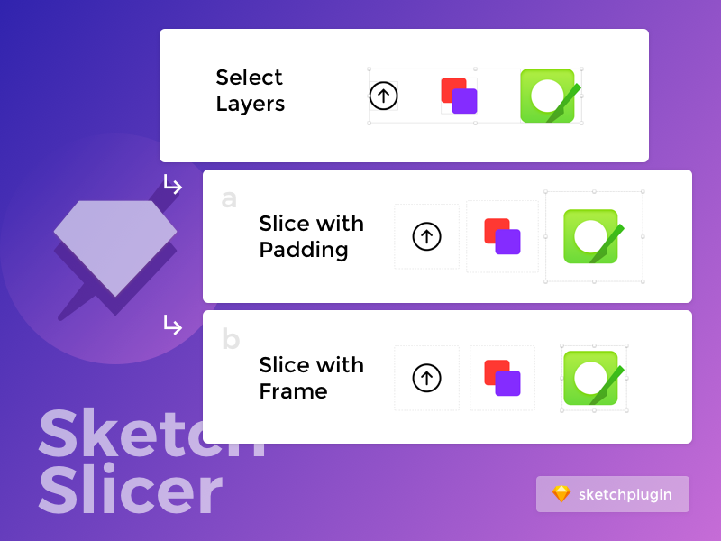

# Sketch Slicer

Sketch plugin for creating slices for selected layers




## How to use
- Select one or more layers
- Run one of the 2 commands: Slice with padding or Slice with frame

## Options

#### Slice with Padding

Padding is the padding of the slice created from selected layers.

Enter one number to have equal padding from all sides, or manually set each of them using order similar to padding shorthand in CSS. For example, setting padding to `24/48` is equivalent to
```
padding: {
    top: 24
    right: 48
    bottom: 24
    left: 48
}
```
and setting padding to `12/14/16` is equivalent to
```
padding: {
    top: 12
    right: 14
    bottom: 16
    left: 14
}
```

Setting padding will not affect the selected layers' position.

#### Slice with Frame

Frame is the dimension of the slice. Using frame, the resulting slice layer will be centered around the selected layer.

Set one number will create a square slice layer, set two numbers to create a rectangle.

```
// 36;48
frame: {
  width: 36,
  height: 48
}

// 36
frame: {
  width: 36,
  height: 36
}
```

Note: If the selected layer doesn't have a rounded dimension (i.e `12.4241 x 14.1241`), setting frame will slightly adjust its position so that the result slice layer is placed on a round pixel and have selected layer centered inside.

#### Select preset

Select one of the presets that you set in Sketch Preference `cmd + , `

#### Create symbol

Create symbol out of the selected layers.


###### TODO
- [x] Set padding for slice
- [x] Set fixed slice size
- [ ] Option to break text inside selected layers
- [x] ~~Set export options~~ Use user's export preset (set it Preference)
- [x] Create symbol with selected layer
  - [ ] If selected layer contains symbol, have an option to detach that nested symbol
